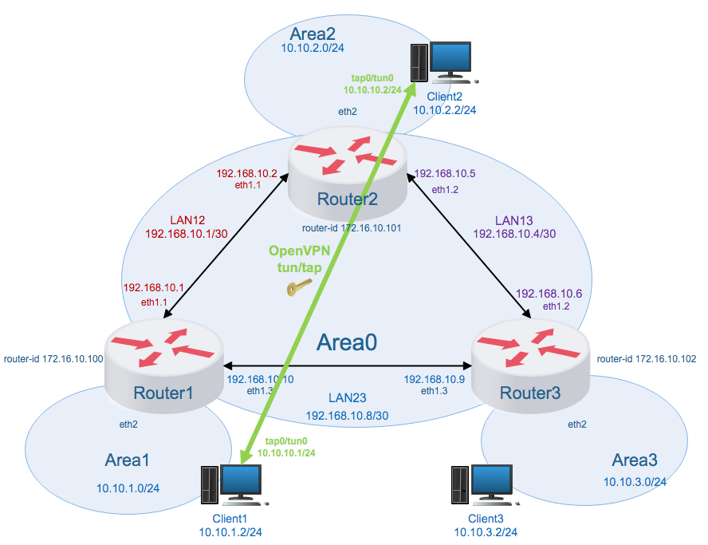
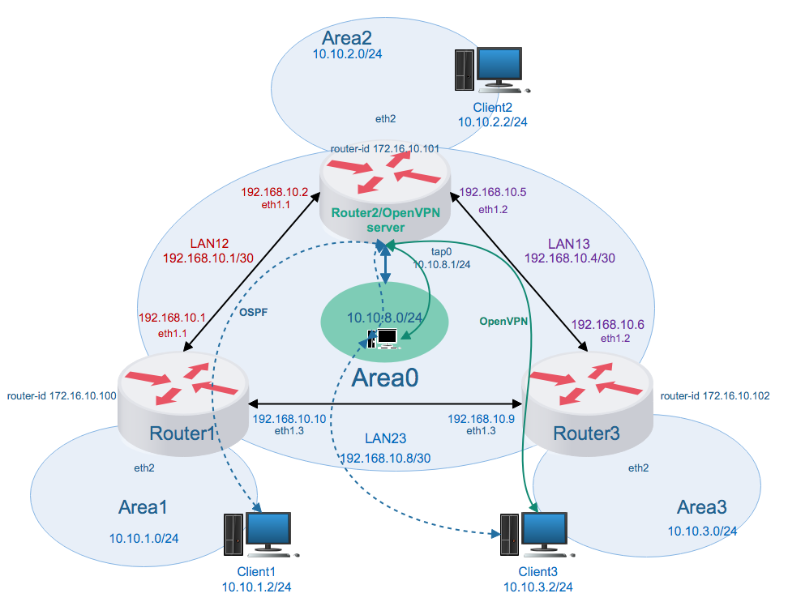

## Мосты, туннели и VPN

```
Домашнее задание:
1. Между двумя виртуалками поднять vpn в режимах
- tun
- tap
Прочуствовать разницу.
2. Поднять RAS на базе OpenVPN с клиентскими сертификатами, подключиться с локальной машины на виртуалку.
```

Возьмем стенд сетевой лаборатории из предыдущего домашнего задания и немного его модифицируем.

- для пункта 1: две виртуальные машины расположенные в разных подсетях, например, Area1 и Area2 должны быть связаны посредством OpenVPN;
- для пункта 2: на Router2 должен быть запущен OpenVPN сервер в режиме RAS, к нему должны подключаться ВМ из разных подсетей (в нашем варианте из Area3), подсеть виртуальных машин подключенных к OpenVPN серверу должна быть доступна из всех подсетей.

### 1. Между двумя виртуальными машинами поднять vpn в разных режимах.



#### 1.1 tap
##### 1.1.1 OpenVPN server

Конфигурация сервера `Client1` (10.10.1.2) с общим ключом:

```
dev tap
ifconfig 10.10.10.1 255.255.255.0
topology subnet
secret static.key
status /var/run/openvpn-status.log
log /var/log/openvpn.log
verb 3```</pre>
```
```
$ systemctl enable openvpn-server@server.service
$ systemctl start openvpn-server@server
```
##### 1.1.2 OpenVPN клиент

[Конфигурация клиента](tap/client.conf) `Client2` (10.10.2.2) с общим ключом:

```
dev tap
remote client1.area1
ifconfig 10.10.10.2 255.255.255.0
topology subnet
secret static.key
status /var/run/openvpn-status.log
log /var/log/openvpn.log
verb 3
```

```
$ systemctl enable openvpn-client@client.service
$ systemctl start openvpn-client@client
```

Проверяем, OpenVPN server:

```
TUN/TAP device tap0 opened
TUN/TAP TX queue length set to 100
do_ifconfig, tt->did_ifconfig_ipv6_setup=0
/sbin/ip link set dev tap0 up mtu 1500
/sbin/ip addr add dev tap0 10.10.10.1/24 broadcast 10.10.10.255
Could not determine IPv4/IPv6 protocol. Using AF_INET
Socket Buffers: R=[212992->212992] S=[212992->212992]
UDPv4 link local (bound): [AF_INET][undef]:1194
UDPv4 link remote: [AF_UNSPEC]
Peer Connection Initiated with [AF_INET]10.10.2.2:57044
```

OpenVPN client:

```
TUN/TAP device tap0 opened
TUN/TAP TX queue length set to 100
do_ifconfig, tt->did_ifconfig_ipv6_setup=0
/sbin/ip link set dev tap0 up mtu 1500
/sbin/ip addr add dev tap0 10.10.10.2/24 broadcast 10.10.10.255
TCP/UDP: Preserving recently used remote address: [AF_INET]10.10.1.2:1194
Socket Buffers: R=[212992->212992] S=[212992->212992]
UDP link local: (not bound)
UDP link remote: [AF_INET]10.10.1.2:1194
Peer Connection Initiated with [AF_INET]10.10.1.2:1194
```

На Client2:
```
$ ping 10.10.10.1
```

На `Router1` выполним `tcpdump -i eth1`:

```
[vagrant@Router1 ~]$ sudo tcpdump -i eth1
tcpdump: verbose output suppressed, use -v or -vv for full protocol decode
listening on eth1, link-type EN10MB (Ethernet), capture size 262144 bytes
14:01:45.152619 IP 10.10.2.2.42476 > client1.area1.openvpn: UDP, length 140
14:01:45.154071 IP client1.area1.openvpn > 10.10.2.2.42476: UDP, length 140
14:01:46.154258 IP 10.10.2.2.42476 > client1.area1.openvpn: UDP, length 140
14:01:46.155720 IP client1.area1.openvpn > 10.10.2.2.42476: UDP, length 140
14:01:46.558415 IP router3 > ospf-all.mcast.net: OSPFv2, Hello, length 48
14:01:46.558453 IP router3-eth13 > ospf-all.mcast.net: OSPFv2, Hello, length 48
14:01:47.155875 IP 10.10.2.2.42476 > client1.area1.openvpn: UDP, length 140
14:01:47.157399 IP client1.area1.openvpn > 10.10.2.2.42476: UDP, length 140
14:01:48.157729 IP 10.10.2.2.42476 > client1.area1.openvpn: UDP, length 140
14:01:48.159169 IP client1.area1.openvpn > 10.10.2.2.42476: UDP, length 140
14:01:49.160275 IP 10.10.2.2.42476 > client1.area1.openvpn: UDP, length 140
14:01:49.162567 IP client1.area1.openvpn > 10.10.2.2.42476: UDP, length 140
14:01:50.162291 IP 10.10.2.2.42476 > client1.area1.openvpn: UDP, length 140
14:01:50.163926 IP client1.area1.openvpn > 10.10.2.2.42476: UDP, length 140
14:01:50.213042 IP router1 > ospf-all.mcast.net: OSPFv2, Hello, length 48
14:01:50.248413 IP router1-eth13 > ospf-all.mcast.net: OSPFv2, Hello, length 48

```

Видим UDP пакеты от openvpn.

#### 1.2 tun

Конфигурация сервера:

```
dev tun
ifconfig 10.10.10.1 10.10.10.2
secret static.key
```

Конфигурация клиента:

```
dev tun
remote client1.area1
ifconfig 10.10.10.2 10.10.10.1
secret static.key
```

В Vagrantfile заккоментирована данная конфигурация сервера и клиента. (Можно запустить одновременно openvpn в режиме tun и tap, добавив конфигурацию с другим именем, запустив второй экземпляр openvpn на сервере и клиенте, не стал этого делать).

#### 1.3 Разница между tap и tun.

Будем измерять скорость с помощью `iperf` для `tap` и для `tun` интерфейсов. На одной ВМ запустим `iperf` в качестве сервера `iperf -s`. На второй запустим с опциями "измерять 30 секнуд в три потока" `iperf -c 10.10.10.1 -P 3 -t 30`. 

**tap**

```
------------------------------------------------------------
Client connecting to 10.10.10.1, TCP port 5001
TCP window size: 94.5 KByte (default)
------------------------------------------------------------
[  5] local 10.10.10.2 port 51678 connected with 10.10.10.1 port 5001
[  3] local 10.10.10.2 port 51674 connected with 10.10.10.1 port 5001
[  4] local 10.10.10.2 port 51676 connected with 10.10.10.1 port 5001
[ ID] Interval       Transfer     Bandwidth
[  3]  0.0-34.3 sec  4.88 MBytes  1.19 Mbits/sec
[  5]  0.0-36.3 sec  4.62 MBytes  1.07 Mbits/sec
[  4]  0.0-40.5 sec  6.00 MBytes  1.24 Mbits/sec
[SUM]  0.0-40.5 sec  15.5 MBytes  3.21 Mbits/sec
```

**tun**

```
------------------------------------------------------------
Client connecting to 10.10.10.1, TCP port 5001
TCP window size: 94.5 KByte (default)
------------------------------------------------------------
[  5] local 10.10.10.2 port 51690 connected with 10.10.10.1 port 5001
[  3] local 10.10.10.2 port 51686 connected with 10.10.10.1 port 5001
[  4] local 10.10.10.2 port 51688 connected with 10.10.10.1 port 5001
[ ID] Interval       Transfer     Bandwidth
[  5]  0.0-35.0 sec  7.38 MBytes  1.77 Mbits/sec
[  3]  0.0-37.0 sec  6.38 MBytes  1.45 Mbits/sec
[  4]  0.0-41.1 sec  2.75 MBytes   561 Kbits/sec
[SUM]  0.0-41.1 sec  16.5 MBytes  3.37 Mbits/sec
```

Скорость передачи для `tun` выше чем для `tap`, что потдверждает теорию ;].

### 2. Поднять RAS на базе OpenVPN с клиентскими сертификатами

Схема сети:



На Router2 установим OpenVPN в качестве сервера. Так же установим easy-rsa для создания PKI инфраструктуры.

#### 2.1 Сертификаты и ключи

Инициализируем хранилище ключей `easyrsa init-pki`, создаем корневой сертификат `easyrsa build-ca nopass`, генерируем ключ Диффи-Хелмана `easyrsa gen-dh`, создаем сертификат и ключ сервера `easyrsa build-server-full server nopass`, создаем сертификат и ключ клиента `easyrsa build-client-full client nopass`. Написан небольшой скрипт, который объединяет конфигурационный файл и все ключи в один файл, для последующей передачи на клиентскую ВМ. Через ansible-провижн забираем ключ с сервера на локальную машину для последующей инсталляции на клиент. 
В файле [fetch.yml](fetch.yml) нужно изменить пути временной директории и директории проекта, т.к. они могут отличаться:

```
  vars:
    temporary_local_path: /tmp
    project_local_path: /root/OtusWork/Homework20/ca  
```

#### 2.2 Настройка сервера

Конфигурационный файл OpenVPN сервера - [server.conf](ca/server.conf). Особенность в том, что мы должны сообщить клиенту новый маршрут по умолчанию, для того, что бы на него можно было попасть из других сетей.

```
push "route 10.10.0.0 255.255.0.0 10.10.8.1"
```

Так же необходимо внести изменения в [zebra.conf](router1/zebra.conf) и [ospfd.conf](router1/ospfd.conf) на Router2, что бы добавились маршруты на подсеть 10.10.8.0/24

#### 2.3 Настройка клиента

Конфигурационный файл OpenVPN клиента - [client.conf](ca/client.conf). Генерируется полностью на сервере скриптом [5in1](ca/5in1) и шаблоном [client.tmpl](ca/client.tmpl). 

#### 2.4 Проверка работы

[Vagrantfile](Vagrantfile) написан таким образом, что все должно подниматься автоматически при запуске виртуальных машин. Сначала запускаем `Router1..3`, далее `Client1..3`. ВМ из предыдущей части ДЗ соединяются напрямую, согласно схеме. Клиент из этой части ДЗ получает адрес `10.10.8.10`.

Тестируем скорость с `Client1`(10.10.1.2) <–> `OpenVPN`(10.10.8.10):

```
[root@Client1 ~]# iperf -c 10.10.8.10 -P 3 -t 30
------------------------------------------------------------
Client connecting to 10.10.8.10, TCP port 5001
TCP window size: 45.0 KByte (default)
------------------------------------------------------------
[  5] local 10.10.1.2 port 47096 connected with 10.10.8.10 port 5001
[  3] local 10.10.1.2 port 47092 connected with 10.10.8.10 port 5001
[  4] local 10.10.1.2 port 47094 connected with 10.10.8.10 port 5001
[ ID] Interval       Transfer     Bandwidth
[  5]  0.0-30.3 sec  4.12 MBytes  1.14 Mbits/sec
[  4]  0.0-30.9 sec  3.12 MBytes   848 Kbits/sec
[  3]  0.0-34.5 sec  2.25 MBytes   547 Kbits/sec
[SUM]  0.0-34.5 sec  9.50 MBytes  2.31 Mbits/sec
```


