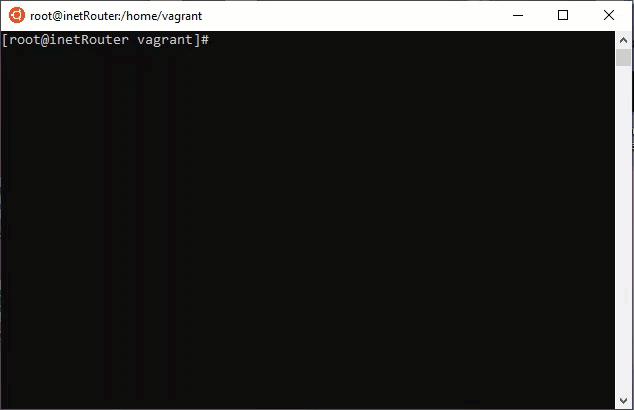

## VLAN. Bonding.

### 1. VLAN

Добавим в Vagrantfile конфигурацию виртуальных машин: testServer1, testServer2, testClient1, testClient2. Сделаем provision посредством shell в vagrant, добавим для каждой виртуальной машины по одному vlan-интерфейсу `eth1.x` через редактирование соответствующего файла настройки интерфейса `/etc/sysconfig/network-scripts/ifcfg-eth1.x`. Для testServer1, testClient1 - `eth1.1`, для testServer2, testClient2 - `eth1.2`. Для серверов ip адрес - 10.10.10.1, для клиентов 10.10.10.255.

Файл конфигурации VLAN-интерфейса будет следующего вида:

```
NM_CONTROLED=no
BOOTPROTO=static
VLAN=yes
ONBOOT=yes
IPADDR=10.10.10.x
NETMASK=255.255.255.0
DEVICE=eth1.x
```

Для тестов, необходимо зайти в каждую ВМ и сделать ping:
**Важно**  
Что бы применились настройки сети через провижн, придется зайти через `vagrant ssh` после создания ВМ и сделать `sudo systemctl restart network`.

- testServer1 <-> testClient1
- testServer2 <-> testClient2

```
[vagrant@testServer2 ~]$ ping 10.10.10.254
PING 10.10.10.254 (10.10.10.254) 56(84) bytes of data.
64 bytes from 10.10.10.254: icmp_seq=1 ttl=64 time=0.574 ms
64 bytes from 10.10.10.254: icmp_seq=2 ttl=64 time=1.21 ms
64 bytes from 10.10.10.254: icmp_seq=3 ttl=64 time=1.30 ms
64 bytes from 10.10.10.254: icmp_seq=4 ttl=64 time=1.25 ms

[vagrant@testServer1 ~]$ ping 10.10.10.254
PING 10.10.10.254 (10.10.10.254) 56(84) bytes of data.
64 bytes from 10.10.10.254: icmp_seq=1 ttl=64 time=0.610 ms
64 bytes from 10.10.10.254: icmp_seq=2 ttl=64 time=1.14 ms
64 bytes from 10.10.10.254: icmp_seq=3 ttl=64 time=1.26 ms

```


### 2. Bonding

Настриваем bond-интерфейс:

- на стороне inetRouter: `eth1`, `eth2`
- на стороне centralRouter: `eth2`, `eth5`

Настройка bond-интерфейса `ifcfg-bond0`:

```
NM_CONTROLED=no
DEVICE=bond0
ONBOOT=yes
TYPE=Bond
BONDING_MASTER=yes
IPADDR=192.168.255.1
PREFIX=30
BOOTPROTO=static
BONDING_OPTS="mode=1 miimon=100 fail_over_mac=1"
```

Настройка интерфейсов входящих в bond-интерфейс:

```
NM_CONTROLED=no
BOOTPROTO=none
ONBOOT=yes
DEVICE=eth1
MASTER=bond0
SLAVE=yes 
```
На `inetRouter`:
```
3: eth1: <BROADCAST,MULTICAST,SLAVE,UP,LOWER_UP> mtu 1500 qdisc pfifo_fast master bond0 state UP group default qlen 1000
    link/ether 08:00:27:3c:47:13 brd ff:ff:ff:ff:ff:ff
4: eth2: <BROADCAST,MULTICAST,SLAVE,UP,LOWER_UP> mtu 1500 qdisc pfifo_fast master bond0 state UP group default qlen 1000
    link/ether 08:00:27:b1:4c:63 brd ff:ff:ff:ff:ff:ff
5: bond0: <BROADCAST,MULTICAST,MASTER,UP,LOWER_UP> mtu 1500 qdisc noqueue state UP group default qlen 1000
    link/ether 08:00:27:3c:47:13 brd ff:ff:ff:ff:ff:ff
    inet 192.168.255.1/30 brd 192.168.255.3 scope global noprefixroute bond0
       valid_lft forever preferred_lft forever
    inet6 fe80::a00:27ff:fe3c:4713/64 scope link
       valid_lft forever preferred_lft forever
```
Видим, что интерфейсы в bond0 и ip адрес висит на bond'е.

Тестируем интерфейс, сделаем две ssh-сессии, в одном терминале пишем: `watch -n1 cat /proc/net/bond0`, в другом - `ifdown eth1 && ifup eth1`.





Наблюдаем за работой bond-интерфейса в режиме active-active. `Currently active slave` меняется при отключении `eth1` на `eth2`, а при включении - обратно.

