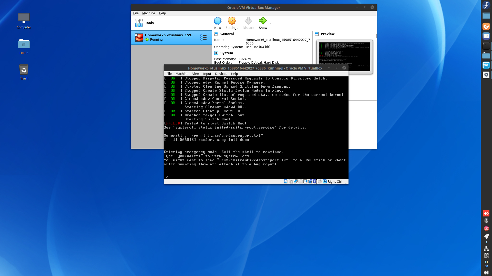
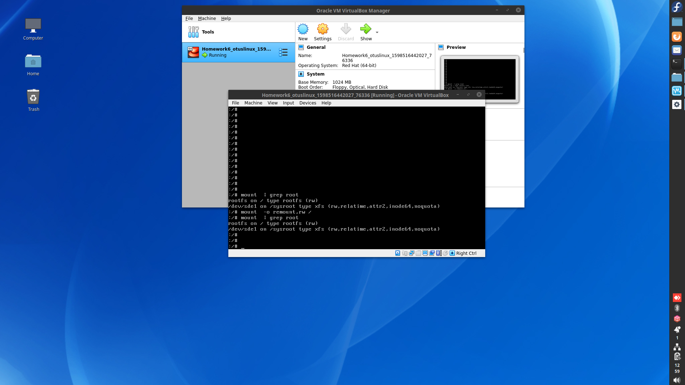
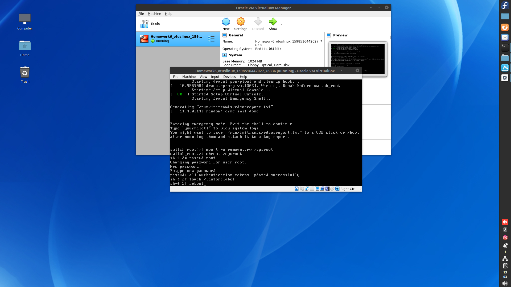
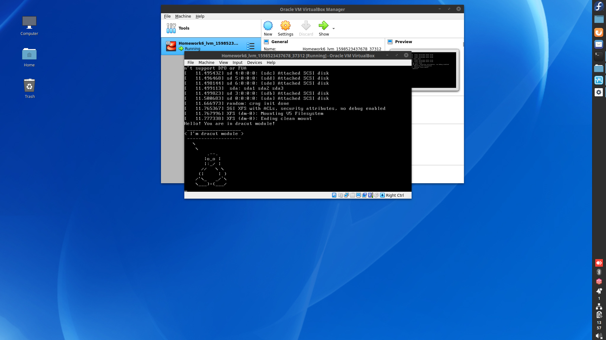

# Homework6. Загрузка системы.

## Попасть в систему без пароля несколькими способами. ##
*Изменим параметры загрузки. Добавим init=/sysroot/bin/sh и сразу изменим режим монтирования с Read-Only, на Read-Write:*

*После нажмем Ctrl+X и при загрузке попадем в аварийный (emergency) режим:*

*Проверим другой вариант. Для этого пропишем в параметрах rd.break и режим монтирования Read-Write и загрузимся в систему:*

*Попадаем в emergency mode. Попробуем поменять пароль:*

*После перезагрузки проверяем вход в систему с новым паролем:*

*Третий способ пропускаю тк я сразу меняла режим монтирования с ro на rw в параметрах загрузки.*

## Установить систему с LVM, после чего переименовать VG ##
*Описание команд сделано в файл при помощи [script](HW6).*

### Добавить модуль в initrd ###
*Описание команд сделано в файл при помощи [script](HW6).*
Итог:

